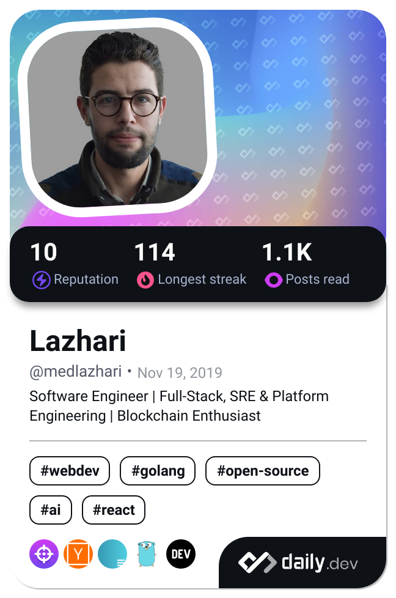

## 👨‍💻 Mohammed Lazhari

I’m a Software Engineer from Morocco with deep expertise in the Go and JavaScript ecosystems, AWS cloud architecture, and DevSecOps. I work across Full-Stack Development, Platform Engineering, and SRE—with a strong interest in Blockchain.

- 🤝 Open to collaborating on open-source and SaaS projects
- 🧠 Ask me about Go, AWS, infrastructure automation (Terraform, Pulumi, Kubernetes), and platform scaling
- 📫 Reach me via: **[LinkedIn](https://dub.sh/lazhari-linkedin), [Twitter](https://dub.sh/lazhari-twitter), [molazhari.dev](https://molazhari.dev/), or [book a meeting](https://dub.sh/quick-chat-cal).**
- ☕️ Fun fact: Debugging is better with good coffee

  
  
  
  
  
  
  
  
  
  
  
  
  
  
  
  
  
  
  
  
  
  
  
  
  
  
  
  
  
  
  
  
  

  

